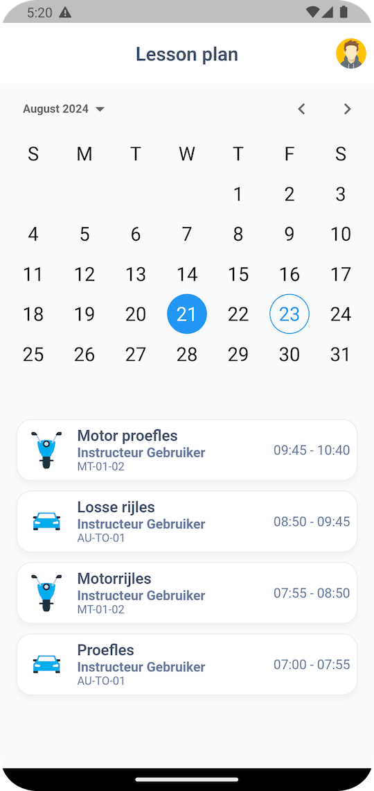

# transpo

Driving School App

| Home Screen | Profile Screen                                                |
| ----------- |---------------------------------------------------------------|
|  |  | 

Application for Driving School Students for view and managing their schedule, schedule lessons with an instructor, view news about the Driving School, receive notifications and etc.

Technical specifications: BloC, GetIt, freezed, json_serializable, injectable, Dio, Intl and etc

## Getting Started

Build APK: flutter build apk --target=lib/main.dart

## Run project
**Prod** - default for release builds.
Compile with injectable environment **.prod** and included Crashlytics configuration:
```sh
flutter run lib/main.dart
```

**Debug** - need to setup IDE as default for debug runs.
Compile with injectable environment **.dev**, without Crashlytics configuration:
```sh
flutter run lib/main_dev.dart
```

<br />

## Generate files
### Injections,  `json_serializable`-models and `freezed`-states:
After adding some new injectable or injecting class need to generate file injection.config.dart, for this do next tasks: update pubspec dependencies and
```sh
flutter packages pub run build_runner build --delete-conflicting-outputs
```

<br />

### Localization and translations
- Need to install the extension in the IDE: `Flutter Intl`

<br />

## Import sorter command (execute after task completion)
```sh
flutter pub run import_sorter:main
```

<br />

## Fix some problems
If after second step happens error, project needs to clean:

1. flutter clean
2. flutter packages pub get
3. flutter packages pub run build_runner build

<br />

## Publishing iOS
- [Read first](https://docs.flutter.dev/deployment/ios)
- or [read second](https://flutter-website-staging.firebaseapp.com/ios-release/)
- or install and open the Apple Transport macOS app. Drag and drop the build/ios/ipa/*.ipa app bundle into the app.

### After building the new version, add `dSYMs` to Crashlytics

<br />

## Before building Android
### Create a `key.properties` file in `<project dir>/android/..` with data, example:
```
storePassword=<value>
keyPassword=<value>
keyAlias=<value>
storeFile=<path to "upload-key.jks">
```

<br />

# Build iOS

```sh
flutter build ios --no-codesign
```

# Build Android

## &#8729; .aab:

```sh
flutter build appbundle --flavor prod --release lib/main.dart
```

## &#8729; .apk:

```sh
flutter build apk --flavor prod --release lib/main.dart
```

## &#8729; Debug .apk:

```sh
flutter build apk --flavor dev --debug lib/main_dev.dart
```
<br />
